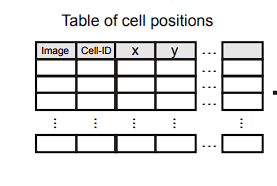

# DBSCAN-CellX
DBSCAN-CellX is a clustering and positional classification tool espacially designed for cell cultures. Made by the AG Graw, Bioquant Heidelberg.

## Structure of this Repo
This Repo consists of two parts, mainly the DBSCAN-CellX Python package and a easy to use GUI.
The folder "dbscan-cellx" is the Python package, which has to be downloaded and installed locally. Please refer to the installation guide. 
The folder called App holds the GUI App called DBSCAN_CellX_App.py. The GUI was made with Streamlit. 

## Installation
### Package
The Python package of DBSCAN-CellX is a standalone package which has to be installed manually. All required dependencies are installed automatically with the installation of the package itself. If the user wants to use the DBSCAN-CellX package together with the GUI, the user has to install the package in the same environment as the App. To install the package the user has to download the whole "dbscan-cellx" folder with all its contents. Next the user has to define a certain environment to install the package into. As mentioned before, if the user wants to use the GUI together with the package, the package has to be installed into the App environment. 
After downloading the user has to open the directory in a terminal of choice and call this installation function inside the directory.
```
C:\Users\USER-NAME\dbscan-cellx> python -m pip install -e .
```
After instalaltion the package should be fully installed inside the opened environment. 

### App
To install the App the easiest way is to install a new (conda) environment with the corresponding environment list. The installation of the whole APp with all its dependencies can be done by downloading the whole App folder. Inside the folder is a file called "env.txt". To install a new fresh conda environment with this file please use the follwing code:
```
conda create --name ENV-NAME --file env.txt
```
Please make sure that the path to the "env.txt" file is set or the current directory is located inside the App folder. 
After the installation is finished, the user can now activate the newly installed conda environment.

## Usage
### DBSCAN-CellX Package
To use the DBSCAN-CellX package after installation, the user has three options. The first option is to call the main function of the DBSCAN-CellX script inside a Python script.
```
from dbscan_cellx import dbscan_cellx # Imports the dbscan_cellx package


dbscan_cellx.main() # Calls the main function
```
Here the user can input the desired parameters found listed below. 

The other option is to call the main function through a terminal. As long as the DBSCAN-CellX package was installed successfully the package can be called from the terminal inside the activated environment directly. The input parameters for the terminal call are done through a seperate ArgumentParser and has a slightly different structure as explanined furhter below. To call the package use:
```
C:\Users\USER-NAME\... > python -m dbscan_cellx [- parameters]
```
The last option to run DBSCAN-CellX is through the App which is explained further below.

### App
To use the App, the user has to navigate theri current directory into the App directory. After the installation of the conda environment and the activation of said environment the user can start the App thorugh:
```
C:\Users\USER-NAME\App> streamlit run DBSCAN_CellX_App.py
```
Now the default browser should open automatically and the App starts running. If not, please copy the Local URL posted in the terminal and open it in a browser. Futher usage instructions of the App are found in the App itself.

## Parameters
As mentioned before the DBSCAN-CellX package has a couple of paramters which the user can change and/or provide. Whether the user uses the package inside the a Pythoin script or the terminal the function call for changing the paramters differs.

| Parameter | Description | Terminal Flag | Default |
| --- | --- | --- | --- |
| files | List of files to input in .csv format | -f --files | - |
| save | Full directory path to the save folder | -sa --save | - |
| pixel_ration | The ratio between the pixels/microns | -p --pixel_ration | - |
| size_x | The full resolution of microns in X direction (in Microns) | -x --size_x | - |
| size_y | The full resolution of microns in Y direction (in Microns) | -y --size_y | - |
| edge_mode | A boolean input if a seperate Edge Detection should be performed | -e --edge_mode | 1 |
| angle_paramter | Int input of the full angle for the edge correction | -a --angle_paramter | 140 |
| save_parameter | Boolean input if a seperate list should be saved containing the calculated nmin and epsilon parameters | -sp --save_parameter | 1 |

A full example call of all paramters inside a python script should look like

```
from dbscan_cellx import dbscan_cellx # Imports the dbscan_cellx package


dbscan_cellx.main(["C:\Users\USER-NAME\file.csv"], "C:\Users\USER-NAME\save_folder\", 2.90, 938.40, 565.80, 1, 140, 1) # Calls the main function
```
Inside the terminal: 
```
C:\Users\USER-NAME\... > python -m dbscan_cellx -f "C:\Users\USER-NAME\file.csv" -sa "C:\Users\USER-NAME\save_folder\" -p 2.90 -x 938.40 -y 565.80 -e 1 -a 140 -sp 1
```
## Required Data Structure
To fully utilze DBSCAN-CellX thorugh this application certain data structure reqeuirments have to be met. The table has to consits of at least 4 columns depicting, a unique Image_ID, Cell ID, X and Y position.Each row represents a unique cell. The columns of Image_ID refers to a unique ID for each image remaining unchaged for each cell i a given image. The Cell ID is a unique ID for each cell in a given image.Both Image ID and Cell ID begin at 1 incrementing by 1 by each row. The data strucutre is comparable to the data output of CellProfiler (Stirling DR; 2021).



