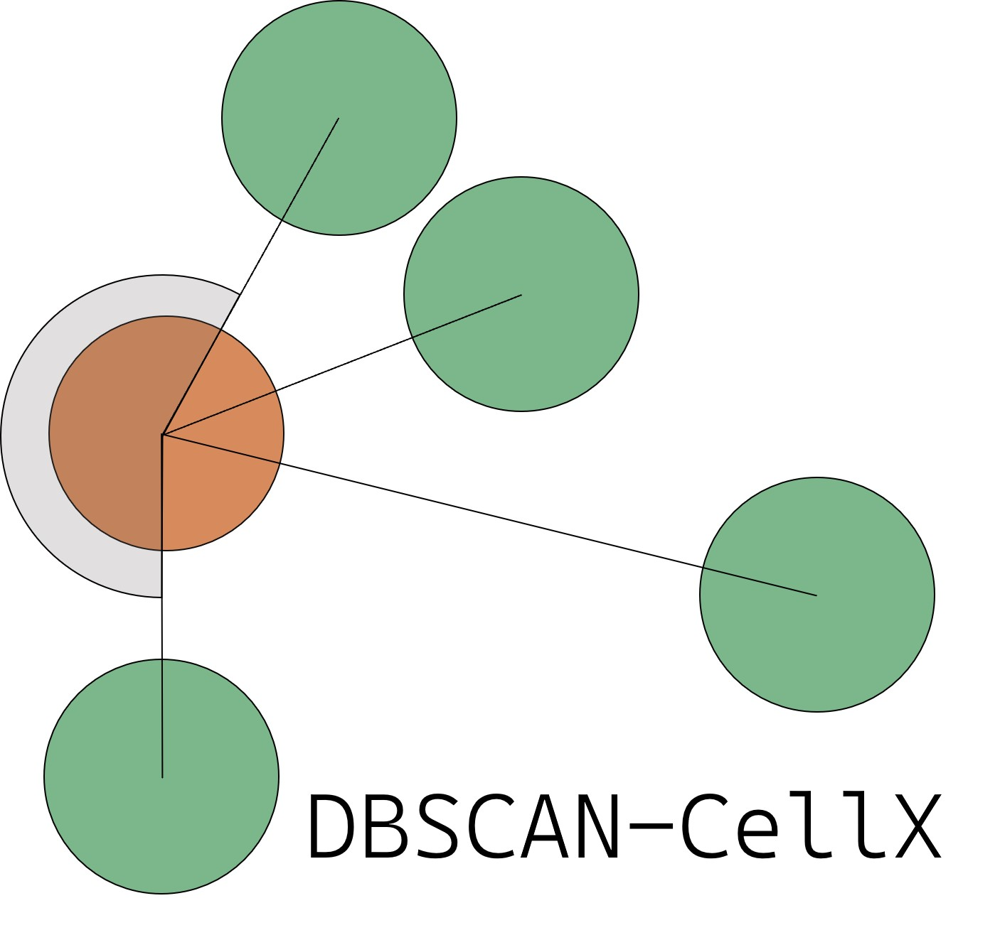
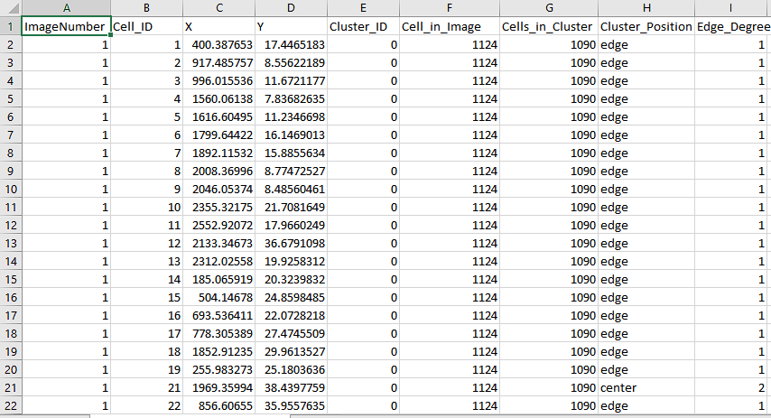

<p align="left">
  
</p>

# DBSCAN-CellX

##  A clustering and positional classification tool espacially designed for cell culture experiments

The package relies on the well-known and frequently used density-based clustering of spatial applications with noise (DBSCAN) from Ester, M., Kriegel, H.-P., Sander, J., and Xu, X. (1996). It contains several extensions that provide an improved parameterization for DBSCAN, as well as enhanced cell classification based on their relative positioning within clusters. These extensions are especially designed for cell culture experiments. Accompanied by a user-friendly App, this python-package can directly be used by experimentalists to analyze their cell imaging data. See also

* Küchenhoff L, Lukas P, ...., Talemi SR, Graw F: **“DBSCAN-CellX – Extended density based clustering methods for cell culture experiments”**.


## Content
This repository consists of two parts. The folder *dbscan-cellx* contains the actual Python package, which comprises all the relevant functions and algorithms. The package has to be downloaded and installed locally as detailed below. The folder called *App* holds the App-based graphical-user-interface, called *DBSCAN_CellX_App.py* developed with Streamlit. The *dbscan-cellx* package can also be run independently of the app.

## Installation
### (a) Package
The Python package of DBSCAN-CellX is a standalone package which has to be installed manually and was developed under python 3.8. All required dependencies are installed automatically with the installation of the package itself. After downloading,  the user has to open a terminal, navigate to the *dbscan-cellx*-folder and install the package via the following command:

```
C:\Users\USER-NAME\dbscan-cellx> python -m pip install -e .
```
After installation the package should be fully usable inside the opened environment (see below). *If the user wants to use the the package in combination with the app-based GUI, the package has to be installed into the App environment (delete?).* 

### (b) Graphical-User-Interface (App)
To install the App, the easiest way is to use the pip installer with the *requirements.txt*-file found in the App-folder. Before installing the required dependencies you have to make sure that you have a functional version of *git* installed.
```
git --version
```
If *git* is not installed, please install it before continuing (see Link/to/git/installation/guide).

Afterwards open a terminal, navigate to the downloaded app-folder "\User\...\DBSCAN-CellX-main\App>" and run the following command:
```
pip install -r requirements.txt
```
This will install the app with all its dependencies and connect it to the DBSCAN-CellX. *Alternatively, installation can be performed by ....*

## Getting to work
### Using the DBSCAN-CellX package
The DBSCAN-CellX package can be used in three different ways: 

#### (1.) Within a Python script
The first option is to call the main function of the DBSCAN-CellX script inside a Python script using the following notation.
```
from dbscan_cellx import dbscan_cellx # Imports the dbscan_cellx package


dbscan_cellx.main() # Calls the main function
```
Specifications that can be provided with the dbscan_cellx command to specify the analysis are listed below. 

#### (2.) Within a terminal
The second option is to call the main function directly within a terminal. After successful installation, the package can be called from the terminal inside the activated environment. The input parameters for the terminal call are done through a seperate ArgumentParser as explanined below. To call the package use:
```
C:\Users\USER-NAME\... > python -m dbscan_cellx [- parameters]
```
#### (3.) Via the App
To use the App, the user has to navigate to the App directory. After installation, the user starts the App via:
```
python -m streamlit run DBSCAN_CellX_App.py # (Windows)

or

streamlit run DBSCAN_CellX_App.py # (Unix-based systems)
```
Now the default browser will open automatically and the App starts running. If the browser does not start automatically, you can copy the Local URL posted in the terminal and open it in a browser. Further intructions of how to use the App are provided in the App itself.

## Parameters for DBSCAN-CellX
As mentioned before, the DBSCAN-CellX package has a couple of parameters which the user can change and/or specify. A list with the name of the parameters and their description is provided below

| Parameter | Description | Terminal Flag | Default |
| --- | --- | --- | --- |
| files | List of files to input in .csv format | -f --files | - |
| save | Full directory path to the save folder | -sa --save | - |
| pixel_ration | The ratio between the pixels/microns | -p --pixel_ration | - |
| size_x | The full resolution of microns in X direction (in Microns) | -x --size_x | - |
| size_y | The full resolution of microns in Y direction (in Microns) | -y --size_y | - |
| edge_mode | A boolean input if Edge-Degree should be determined | -e --edge_mode | 1 |
| angle_paramter | Int input of the full angle for the edge correction | -a --angle_paramter | 140 |
| save_parameter | Boolean input if a seperate list should be saved containing the calculated nmin and epsilon parameters | -sp --save_parameter | 1 |

Whether the user uses the package inside a Python script (Option 1) or the terminal (Option 2), the actual function call for changing the parameters differs.
A full example call of all parameters inside a python script (Option 1) by applying dbscan_cellx to *file.csv* which defines a table with the positions of cells within an image of size 938.4 x 565.8 microns^2 in x- and y-dimension obtained at a resolution of 2.9 microns/pixel, will look like:

```
from dbscan_cellx import dbscan_cellx # Imports the dbscan_cellx package


dbscan_cellx.main(["C:\Users\USER-NAME\file.csv"], "C:\Users\USER-NAME\save_folder\", 2.90, 938.40, 565.80, 1, 140, 1) # Calls the main function
```
Hereby, a Edge-Correction will be run using the default threshold-angle of 140, as well as a calculation of the Edge-Degree for each cell. Results are specified to be saved to the *save_folder*, including the list of determined DBSCAN-parameters. 

In contrast, inside the terminal (Option 2), the parameters are specified as follows: 
```
C:\Users\USER-NAME\... > python -m dbscan_cellx -f C:\Users\USER-NAME\file.csv -sa C:\Users\USER-NAME\save_folder\ -p 2.90 -x 938.40 -y 565.80 -e 1 -a 140 -sp 1
```
Within the App, all parameters can be specified and set within graphically indicated locations (see documentaion of the App).

## Input
As an input, DBSCAN-CellX requires a table that contains the position and coordinates of each identified object/cell, as e.g. obtained by CellProfiler (Stirling DR; 2021) or any other image analysis tool. The table has to consits of at least 4 columns depicting, (i) a unique Image_ID for each of the images analyzed, (ii) a unique Cell ID for each cell within a particular image, and the (iii) X- and (iv) Y-position of the cell given either in pixels or microns. Each row has to represent the information for a unique cell (see figure below). Besides these required columns, the table can contain additional features for each cell. 
Please note that the first two columns of the table always have to be Image_ID and CellID, while the columns of X- and Y-position can be placed anywhere in the table, but have to be named by "X" and "Y". 


In the app, the original images can be additionally provided as an input to visualized the performed analysis in comparison to the original data.

## Ouput
DBSCAN-CellX generates a .csv file as an output with the same name as the input file, and the file name extension DBSCAN_CellX_output. The main output results in four addtional columns that are added to the table. If the user additionally specifies to calculated the Edge-Degree Determination, a fith column is containing the Edge-Degree is added as well. 

| Output | Description |
| --- | --- |
| Cluster_ID | A unique ID for each identified cluster per image. Noise cells are all clustered with ID "-1" |
| Cell_in_Image | The number of cells counted in the whole image | 
| Cells_in_Cluster | The number of cells in a given cluster | 
| Cluster_Position | The classification of a single cell into noise, edge or center | 
| Edge_Degree (Optional) | The edge-degree of a cell defining the degree of embedding of cells within clusters. "0" always corresponds to noise cells. The higher the number, the more central a cell is located within a given cluster  |

If the user specifies to save a seperate paramters list, the output generates an additional *.csv*-file that includes the determined DBSCAN-parameters for each of the images analzed.

| Output | Description |
| --- | --- |
| Image_ID | A unique ID for each image input in the original .csv file |
| n_min | The calculated optimal n_min paramter for the DBSCAN algorithm per image | 
| Epsilon | The calculated optimal Epsilon paramter for the DBSCAN algorithm per image |





